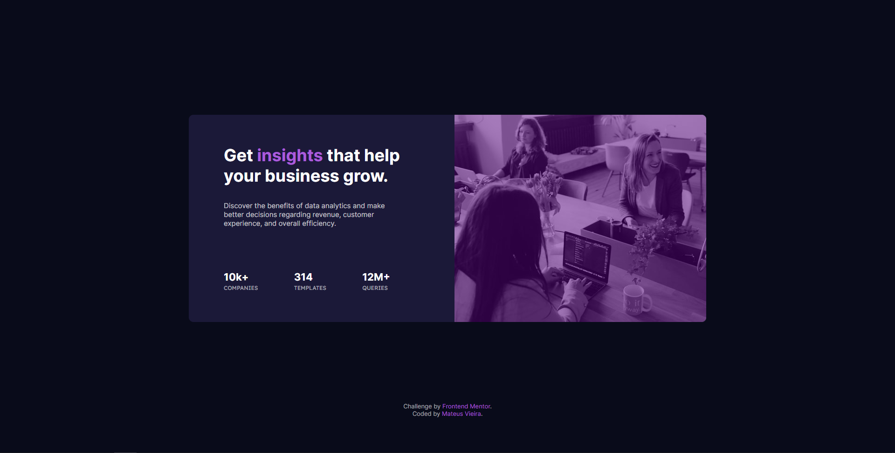
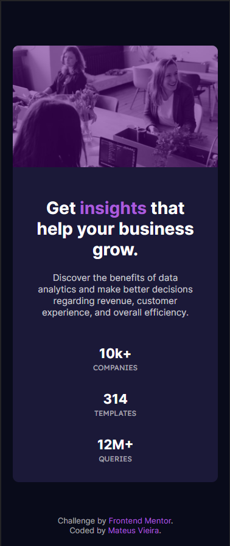

# Frontend Mentor - Stats preview card component solution

This is a solution to the [Stats preview card component challenge on Frontend Mentor](https://www.frontendmentor.io/challenges/stats-preview-card-component-8JqbgoU62). Frontend Mentor challenges help you improve your coding skills by building realistic projects. 

## Table of contents

- [Frontend Mentor - Stats preview card component solution](#frontend-mentor---stats-preview-card-component-solution)
  - [Table of contents](#table-of-contents)
  - [Overview](#overview)
    - [The challenge](#the-challenge)
    - [Screenshot](#screenshot)
  - [My process](#my-process)
    - [Built with](#built-with)
    - [What I learned](#what-i-learned)
    - [Continued development](#continued-development)
    - [Useful resources](#useful-resources)
  - [Author](#author)

## Overview

### The challenge

Users should be able to:

- View the optimal layout depending on their device's screen size

### Screenshot

- Desktop 

<p align="center"></p>

- Mobile

<p align="center"></p>

## My process

### Built with

- Semantic HTML5 markup
- Google Fonts
- CSS custom properties
- Flexbox
- CSS Grid
- Mobile-first workflow


### What I learned

- CSS Flexbox

````css
.card {
    display: flex;
    flex-direction: row;
    justify-content: space-between;
}
````

- CSS Grid

```css
main {
    display: grid;
    align-items: center;
}
.attribution {
    grid-area: 3;
}
.card {
    grid-area: 2;
}
```


### Continued development

This was my first project built with HTML and CSS, so I learned a lot here. The final result isn't as good as I expected, but for my first code I think it's fine.

### Useful resources

- [Alura Flexbox](https://www.alura.com.br/artigos/css-guia-do-flexbox?gclid=Cj0KCQjwssyJBhDXARIsAK98ITRM6sJ_nUPb9VzIyZEF9nBS68MiFSNC0X87sl9RyQLQnvdRYNFW9eQaAjmNEALw_wcB) - This helped me learn a little about Flexbox

## Author

- Instagram - [@mateusvrs](https://www.instagram.com/mateusvrs)
- Linkedin - [@mateusvrs](https://www.linkedin.com/in/mateusvrs/)
